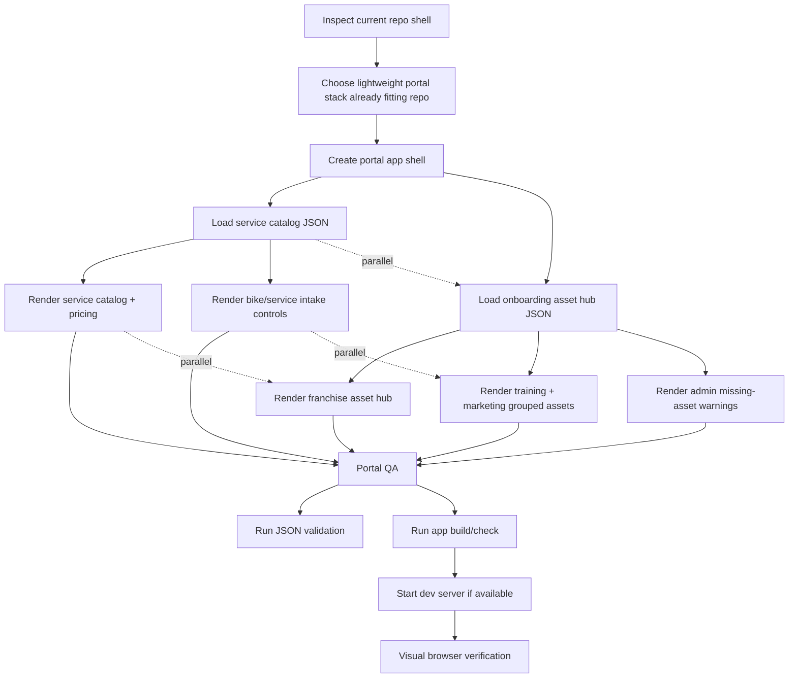

# Visual Plan: TBT Racing Full Portal Implementation

## Step 1: ASCII Architecture Map

```text
┌─────────────────────────────────────────────────────────────────────────────┐
│ User-Facing TBT Portal                                                      │
│ /Users/julianbradley/repos/Travis-Allen-main-app                            │
└────────────────────────────────────┬────────────────────────────────────────┘
                                     │ reads local app manifests
                                     ▼
┌─────────────────────────────────────────────────────────────────────────────┐
│ Portal App Shell                                                            │
│ navigation, section layout, status panels, controlled access messaging       │
├──────────────┬──────────────┬──────────────┬──────────────┬────────────────┤
│ Asset Hub    │ Service      │ Bike Intake  │ Training     │ Admin/Missing  │
│ resources    │ Catalog      │ workflow     │ + Marketing  │ Assets         │
└──────┬───────┴──────┬───────┴──────┬───────┴──────┬───────┴──────┬─────────┘
       │              │              │              │              │
       ▼              ▼              ▼              ▼              ▼
┌──────────────┐ ┌──────────────┐ ┌──────────────┐ ┌──────────────┐ ┌──────────────┐
│ Drive Hub    │ │ Pricing +    │ │ Brand/Skill/ │ │ Playbooks +  │ │ Missing Logo │
│ Manifest     │ │ Services     │ │ Use/Location │ │ Campaigns    │ │ Trailer Art  │
│ JSON         │ │ JSON         │ │ JSON         │ │ JSON links   │ │ JSON status  │
└──────┬───────┘ └──────┬───────┘ └──────┬───────┘ └──────┬───────┘ └──────┬───────┘
       │                │                │                │                │
       │                └────────────────┼────────────────┘                │
       │                                 │                                 │
       ▼                                 ▼                                 ▼
┌──────────────────────┐     ┌──────────────────────────────┐    ┌─────────────────────┐
│ Google Drive         │     │ Imported Source PDFs          │    │ Admin Follow-Ups    │
│ Asset Hub Folder     │     │ docs/source/tbt-drive         │    │ client upload needed│
│ shortcuts + access   │     │ raw evidence + extracted md   │    │ no blocking service │
└──────────────────────┘     └──────────────────────────────┘    └─────────────────────┘

External services/APIs:
┌─────────────────────────────────────────────────────────────────────────────┐
│ Google Drive is linked only through manifest URLs/IDs.                      │
│ The portal does not call Drive APIs in v1; it exposes controlled hub links. │
└─────────────────────────────────────────────────────────────────────────────┘
```

## Step 2: Mermaid Dependency Graph



## Step 3: Component Breakdown Table

| Component | Purpose | Inputs | Outputs | Dependencies |
|---|---|---|---|---|
| Portal App Shell | Main user-facing TBT portal with navigation and section layout | Local repo, existing package shape | Full portal page/app | Repo framework choice from inspection |
| Service Catalog Section | Show service types, pricing, brands, colors, rider skills, locations | `src/data/tbt-service-catalog.json` | Catalog cards, pricing table, source status | Service manifest |
| Bike + Service Intake | Let user select brand, skill, bike use, service type, location | Service catalog arrays | Intake summary and selected service context | Service manifest |
| Franchise Asset Hub | Expose one controlled Drive access point and section folders | `src/data/tbt-onboarding-asset-hub.json` | Hub link, section list, access message | Hub manifest |
| Training + Marketing Assets | Group playbooks, trailer/sticker/marketing resources by section | Hub manifest assets | Resource lists linked through manifests | Hub manifest |
| Admin / Missing Assets | Surface missing logo and trailer art as follow-up blockers | Hub manifest missing assets | Admin warnings and upload checklist | Hub manifest |
| Source Evidence Docs | Preserve imported PDFs and extracted markdown | `docs/source/tbt-drive/*` | Audit trail/source-of-truth references | Existing imported files |
| Verification | Prove manifests parse and portal renders | JSON manifests, app scripts, browser | Valid JSON, passing build/check, screenshot/manual verification | Tooling discovered in repo |
```

