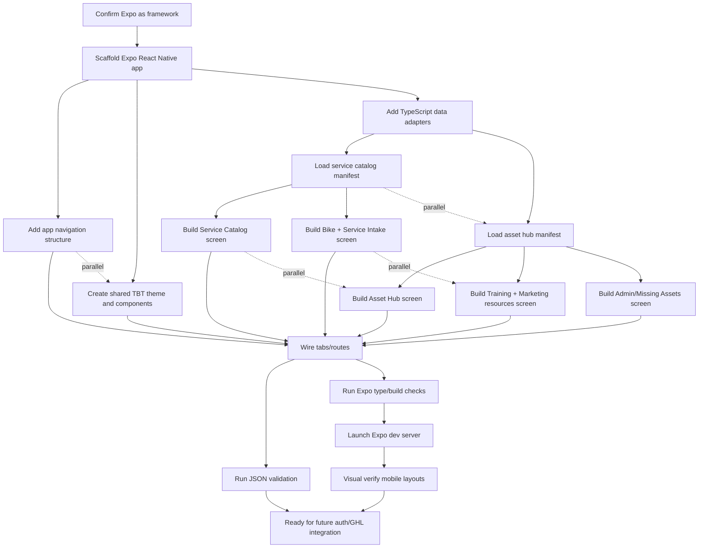

# Visual Plan: Expo Framework for TBT Racing Portal

## Step 1: ASCII Architecture Map

```text
┌─────────────────────────────────────────────────────────────────────────────┐
│ TBT Racing Mobile Portal                                                    │
│ Expo / React Native framework in Travis-Allen-main-app                      │
│ One codebase → iOS + Android                                                │
└────────────────────────────────────┬────────────────────────────────────────┘
                                     │
                                     ▼
┌─────────────────────────────────────────────────────────────────────────────┐
│ Expo App Shell                                                              │
│ app navigation, tabs/stack routes, brand theme, shared UI components         │
├───────────────┬────────────────┬────────────────┬────────────────┬────────┤
│ Home          │ Service Intake │ Asset Hub      │ Training       │ Admin  │
│ Dashboard     │ + Catalog      │ Resources      │ Marketing      │ Status │
└───────┬───────┴────────┬───────┴────────┬───────┴────────┬───────┴────────┘
        │                │                │                │
        ▼                ▼                ▼                ▼
┌──────────────┐ ┌────────────────┐ ┌────────────────┐ ┌────────────────────┐
│ Local Data   │ │ Service Catalog│ │ Asset Hub      │ │ Missing Asset      │
│ Layer        │ │ Manifest       │ │ Manifest       │ │ Warnings           │
├──────────────┤ ├────────────────┤ ├────────────────┤ ├────────────────────┤
│ TypeScript   │ │ tbt-service-   │ │ tbt-onboarding │ │ logo package       │
│ adapters     │ │ catalog.json   │ │ asset-hub.json │ │ trailer art        │
└──────┬───────┘ └────────┬───────┘ └────────┬───────┘ └─────────┬──────────┘
       │                  │                  │                   │
       │ reads/imports     │                  │                   │
       ▼                  ▼                  ▼                   ▼
┌─────────────────────────────────────────────────────────────────────────────┐
│ Repo Source Package                                                         │
│ docs/source/tbt-drive raw PDFs + extracted markdown                          │
│ src/data JSON manifests                                                      │
└────────────────────────────────────┬────────────────────────────────────────┘
                                     │ outbound links only in v1
                                     ▼
┌─────────────────────────────────────────────────────────────────────────────┐
│ External Services                                                           │
├──────────────────────┬──────────────────────┬───────────────────────────────┤
│ Google Drive Hub     │ Future GoHighLevel   │ Future Auth / Role Control    │
│ asset shortcuts      │ CRM, forms, email    │ franchise/admin segmentation  │
└──────────────────────┴──────────────────────┴───────────────────────────────┘

User-facing entry points:
┌──────────────────────────────┬──────────────────────────────┐
│ iOS app via Expo/EAS          │ Android app via Expo/EAS      │
│ franchise/service users       │ franchise/service users       │
└──────────────────────────────┴──────────────────────────────┘
```

## Step 2: Mermaid Dependency Graph



## Step 3: Component Breakdown Table

| Component | Purpose | Inputs | Outputs | Dependencies |
|---|---|---|---|---|
| Expo App Shell | Create the cross-platform iOS/Android app foundation | Empty repo shell, Expo tooling | Runnable Expo app | Node/npm, Expo packages |
| Navigation | Organize portal into usable mobile routes | Screen list, user workflows | Home, Service, Assets, Training, Admin screens | Expo Router or React Navigation |
| TBT Theme | Apply consistent motorsport styling and brand colors | `brandGuidelines.colors`, TBT SSOT style | Shared colors, spacing, typography choices | Service catalog manifest |
| Data Adapters | Keep UI reading manifests instead of hardcoded Drive links | `src/data/*.json` | Typed app data objects | TypeScript |
| Service Catalog Screen | Show service pricing, service types, brands, locations | `tbt-service-catalog.json` | Searchable/scannable service info | Data adapters |
| Bike + Service Intake Screen | Let users assemble service context | Brands, skill levels, bike uses, service types, locations | Intake summary ready for future form/GHL submit | Service catalog |
| Asset Hub Screen | Present one controlled access point | `tbt-onboarding-asset-hub.json` | Hub link, folder sections, access rules | Hub manifest |
| Training + Marketing Screen | Group playbooks and trailer/sticker campaign resources | Hub manifest asset sections | Resource lists with outbound Drive links | Hub manifest |
| Admin / Missing Assets Screen | Show required follow-up files and access warnings | `missingAssets`, access-control notes | Logo/trailer upload checklist | Hub manifest |
| Future Auth/GHL Layer | Later segment franchise/admin users and submit forms/leads | GHL sub-account, auth provider, user roles | Login, role-based access, CRM workflows | Not required for v1 scaffold |
| Verification | Prove app and data work | JSON manifests, Expo scripts, mobile viewport | Valid JSON, passing checks, visual confirmation | Local dev server |
```

