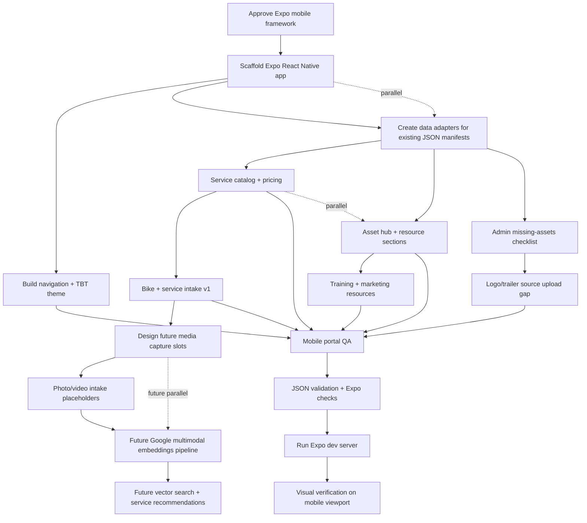

# Visual Plan: Expo TBT Portal with Future Visual Intelligence

## Step 1: ASCII Architecture Map

```text
┌─────────────────────────────────────────────────────────────────────────────┐
│ TBT Racing Mobile Portal                                                    │
│ Expo / React Native: one codebase for iOS + Android                         │
└────────────────────────────────────┬────────────────────────────────────────┘
                                     │
                                     ▼
┌─────────────────────────────────────────────────────────────────────────────┐
│ Expo App Shell                                                              │
│ mobile navigation, TBT theme, shared cards/forms/resource components         │
├──────────────┬──────────────┬──────────────┬──────────────┬────────────────┤
│ Home         │ Service      │ Asset Hub    │ Training +   │ Admin +        │
│ Dashboard    │ Intake       │ Resources    │ Marketing    │ Missing Assets │
└──────┬───────┴──────┬───────┴──────┬───────┴──────┬───────┴──────┬─────────┘
       │              │              │              │              │
       ▼              ▼              ▼              ▼              ▼
┌──────────────┐ ┌──────────────┐ ┌──────────────┐ ┌──────────────┐ ┌──────────────┐
│ Service      │ │ Bike / Rider │ │ Drive Hub    │ │ Playbooks +  │ │ Missing Logo │
│ Catalog JSON │ │ Intake State │ │ Manifest     │ │ Campaigns    │ │ Trailer Art  │
└──────┬───────┘ └──────┬───────┘ └──────┬───────┘ └──────┬───────┘ └──────┬───────┘
       │                │                │                │                │
       └────────────────┼────────────────┼────────────────┼────────────────┘
                        │                │                │
                        ▼                ▼                ▼
┌─────────────────────────────────────────────────────────────────────────────┐
│ Local Source Package                                                        │
│ src/data/*.json + docs/source/tbt-drive PDFs + extracted markdown            │
└────────────────────────────────────┬────────────────────────────────────────┘
                                     │
                                     │ future upload/sync path
                                     ▼
┌─────────────────────────────────────────────────────────────────────────────┐
│ Visual Intelligence Layer (future-ready, not blocking v1 scaffold)           │
├──────────────────────┬──────────────────────┬───────────────────────────────┤
│ Capture / Upload      │ Processing Queue      │ Google Multimodal AI          │
│ photos, videos, bike  │ normalize metadata    │ embeddings + visual analysis  │
│ parts, service issues │ extract frames/video  │ similarity + classification   │
└──────────┬───────────┴──────────┬───────────┴──────────────┬────────────────┘
           │                      │                          │
           ▼                      ▼                          ▼
┌───────────────────┐   ┌──────────────────────┐   ┌──────────────────────────┐
│ Media Object Store │   │ Vector Index / Search│   │ Service Recommendations  │
│ original files     │   │ find similar bikes,  │   │ likely service type,      │
│ photos/video/frame │   │ parts, damage, setup │   │ prep checklist, resources │
└───────────────────┘   └──────────────────────┘   └──────────────────────────┘
                                     │
                                     ▼
┌─────────────────────────────────────────────────────────────────────────────┐
│ External Services                                                           │
├──────────────────────┬──────────────────────┬───────────────────────────────┤
│ Google Drive Hub     │ Google/Vertex AI      │ Future GoHighLevel + Auth     │
│ controlled resources │ multimodal embeddings │ CRM workflows + role control  │
└──────────────────────┴──────────────────────┴───────────────────────────────┘

User-facing entry points:
┌──────────────────────────────┬──────────────────────────────┬──────────────┐
│ iOS Expo app                  │ Android Expo app              │ Future admin │
│ franchise/service users       │ franchise/service users       │ web/portal   │
└──────────────────────────────┴──────────────────────────────┴──────────────┘
```

## Step 2: Mermaid Dependency Graph



## Step 3: Component Breakdown Table

| Component | Purpose | Inputs | Outputs | Dependencies |
|---|---|---|---|---|
| Expo App Shell | Cross-platform mobile foundation for iOS and Android | Empty repo shell, Expo tooling | Runnable mobile app | Node/npm, Expo |
| TBT Portal Navigation | Organize mobile portal into clear user flows | Home, Service, Assets, Training, Admin sections | Tabs/routes/screens | Expo Router or React Navigation |
| Service Catalog | Render services, prices, brands, skills, uses, locations | `tbt-service-catalog.json` | Catalog UI and intake options | Local data adapter |
| Asset Hub | Show one controlled resource access point | `tbt-onboarding-asset-hub.json` | Drive hub link, grouped resources | Local data adapter |
| Admin Missing Assets | Track missing clean logo and trailer/source art | `missingAssets` list | Upload checklist and warnings | Asset hub manifest |
| Bike + Service Intake | Let users select bike/service context now; later attach media | brand, rider skill, use, service, location | Intake summary and future submission shape | Service catalog |
| Media Capture Slots | Prepare app structure for future photo/video analysis | service intake context, user media | upload-ready media records | Expo media/file APIs later |
| Google Multimodal AI Layer | Future analysis of videos, pictures, and images for service help | photos, videos, extracted frames, metadata | embeddings, classifications, similar examples | Google/Vertex AI, storage, backend |
| Vector Search / Recommendations | Future service assistant for similar bikes/issues/assets | embeddings + service catalog | likely service type, resource suggestions | Vector DB/index, AI pipeline |
| GoHighLevel/Auth Layer | Future CRM, roles, offboarding, and lead separation | GHL subaccounts, users, forms | CRM records, role-based access | GHL + auth provider |
```

