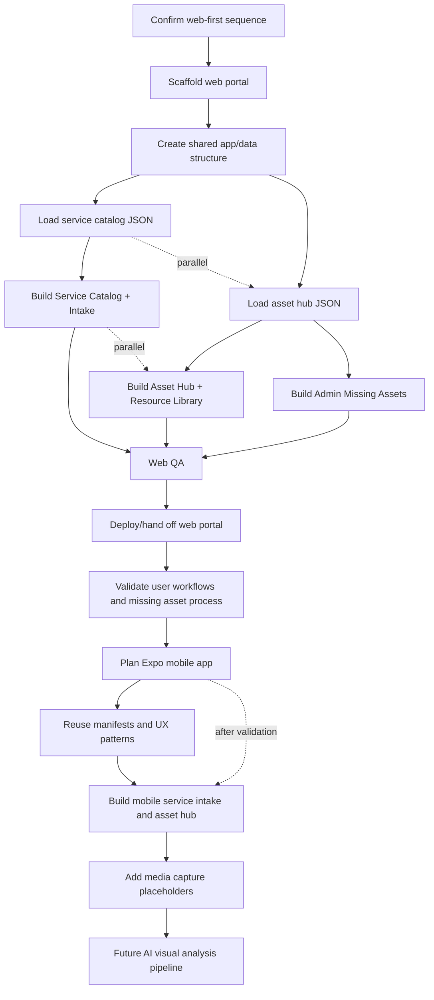

# Visual Plan: TBT Web Portal First, Mobile App Second

## Step 1: ASCII Architecture Map

```text
┌─────────────────────────────────────────────────────────────────────────────┐
│ Phase 1: TBT Web Portal                                                     │
│ Fastest/lowest-cost first release                                           │
│ Works on desktop + mobile browser                                           │
└────────────────────────────────────┬────────────────────────────────────────┘
                                     │ reads shared manifests
                                     ▼
┌─────────────────────────────────────────────────────────────────────────────┐
│ Web App Shell                                                               │
│ React/Vite or Next-style single-page portal depending on repo setup          │
├──────────────┬──────────────┬──────────────┬──────────────┬────────────────┤
│ Home         │ Service      │ Franchise    │ Training +   │ Admin +        │
│ Dashboard    │ Catalog/     │ Asset Hub    │ Marketing    │ Missing Assets │
│              │ Intake       │              │ Resources    │                │
└──────┬───────┴──────┬───────┴──────┬───────┴──────┬───────┴──────┬─────────┘
       │              │              │              │              │
       ▼              ▼              ▼              ▼              ▼
┌──────────────┐ ┌──────────────┐ ┌──────────────┐ ┌──────────────┐ ┌──────────────┐
│ Service      │ │ Bike/Service │ │ Drive Hub    │ │ Playbooks +  │ │ Logo/Trailer │
│ Data JSON    │ │ Intake State │ │ Manifest     │ │ Campaigns    │ │ Gaps         │
└──────┬───────┘ └──────┬───────┘ └──────┬───────┘ └──────┬───────┘ └──────┬───────┘
       │                │                │                │                │
       └────────────────┼────────────────┼────────────────┼────────────────┘
                        ▼                ▼                ▼
┌─────────────────────────────────────────────────────────────────────────────┐
│ Shared Data + Source Package                                                │
│ src/data/tbt-service-catalog.json                                           │
│ src/data/tbt-onboarding-asset-hub.json                                      │
│ docs/source/tbt-drive raw PDFs + extracted markdown                          │
└────────────────────────────────────┬────────────────────────────────────────┘
                                     │ same source layer reused later
                                     ▼
┌─────────────────────────────────────────────────────────────────────────────┐
│ Phase 2: Expo Mobile App                                                    │
│ iOS + Android after web portal is validated                                 │
├──────────────────────┬──────────────────────┬───────────────────────────────┤
│ Mobile service intake │ Mobile asset hub      │ Mobile media capture slots    │
│ reused data manifests │ reused Drive manifest │ photos/videos for future AI   │
└──────────────────────┴──────────────────────┴───────────────────────────────┘
                                     │ future, not v1
                                     ▼
┌─────────────────────────────────────────────────────────────────────────────┐
│ Future Visual Intelligence                                                  │
│ Google/Vertex multimodal embeddings, media storage, vector search,           │
│ service recommendations, similar bike/part/problem matching                  │
└─────────────────────────────────────────────────────────────────────────────┘

External services/APIs:
┌──────────────────────────────┬──────────────────────────────┬──────────────┐
│ Google Drive Asset Hub        │ Future GoHighLevel/Auth       │ Future AI    │
│ outbound controlled links     │ roles, CRM, workflows         │ visual search│
└──────────────────────────────┴──────────────────────────────┴──────────────┘

User-facing entry points:
┌──────────────────────────────┬──────────────────────────────┐
│ Phase 1: Web portal URL       │ Phase 2: iOS/Android app      │
│ customers/franchise/admin     │ same portal concepts native   │
└──────────────────────────────┴──────────────────────────────┘
```

## Step 2: Mermaid Dependency Graph



## Step 3: Component Breakdown Table

| Component | Purpose | Inputs | Outputs | Dependencies |
|---|---|---|---|---|
| Web Portal Shell | Ship the fastest first usable TBT portal | Empty repo shell, local manifests | Responsive web app | React/Vite or equivalent lightweight web stack |
| Shared Data Layer | Keep web and mobile using the same source data | `src/data/*.json` | Typed/validated data adapters | Existing manifests |
| Service Catalog + Intake | Show services/pricing and collect service context | service catalog manifest | Web service catalog and intake summary | Shared data layer |
| Asset Hub + Resource Library | Present one controlled access point and grouped resources | asset hub manifest | Web resource library with Drive links | Shared data layer |
| Admin Missing Assets | Show logo/trailer art blockers and upload checklist | `missingAssets` | Admin warning panel | Asset hub manifest |
| Mobile App Phase | Build iOS/Android only after web flow is validated | web UX, shared manifests | Expo mobile app | Web portal decisions |
| Media Capture Slots | Prepare mobile for future visual analysis | service intake context | photo/video placeholder flow | Expo phase |
| Future Visual Intelligence | Analyze photos/videos for service help later | media, metadata, Google/Vertex AI | embeddings, recommendations | storage/backend/vector index |
```

